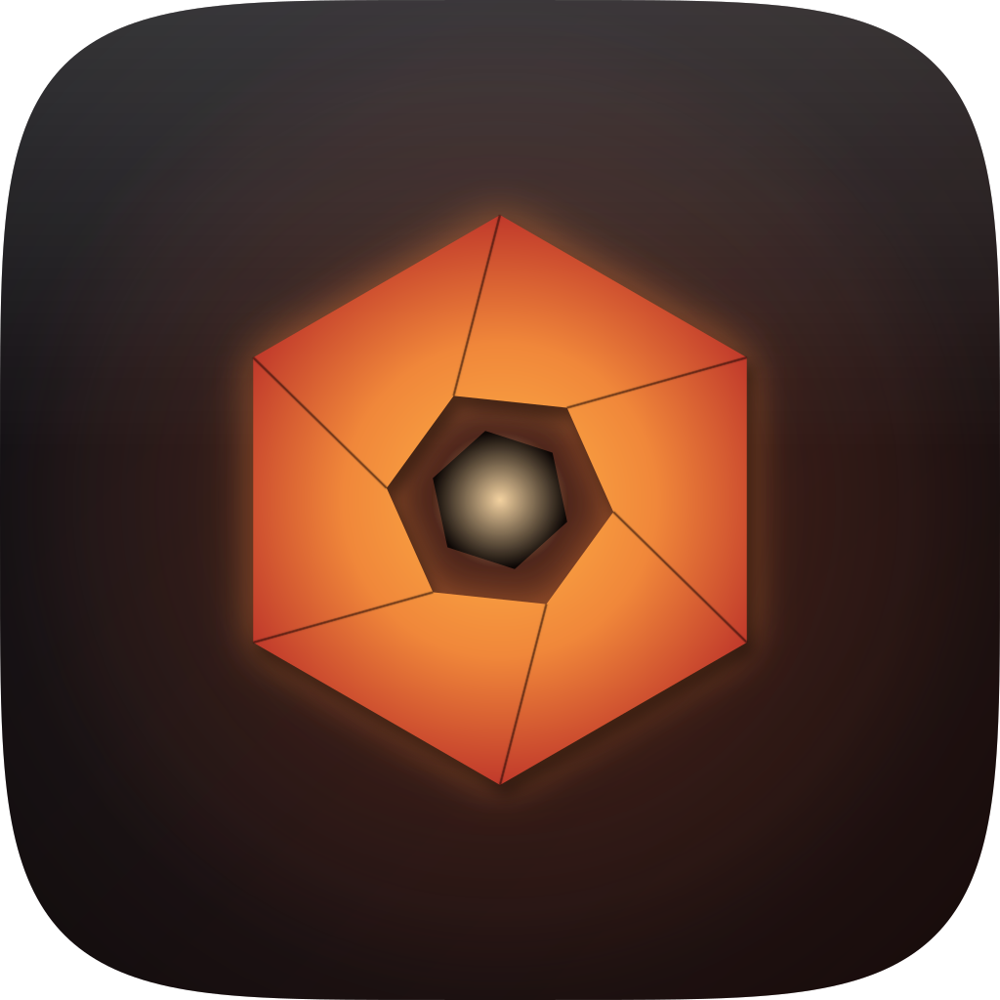

<div align="center">



# Darkroom

**A fast, private RAW photo editor &amp; library for your Mac.**

[](../../releases/latest)
[](../../releases)


</div>

Darkroom lets you import, organize, and edit your camera's RAW photos — entirely on your Mac.
No account, no cloud, no subscription. Your original files are never modified and never leave your
computer.

## Download

Grab the latest `.dmg` from the **[Releases page](../../releases/latest)**:

- **Apple Silicon** (M1–M4): `Darkroom_<version>_aarch64.dmg`
- **Intel**: `Darkroom_<version>_x64.dmg`

Open the `.dmg` and drag **Darkroom** into your Applications folder. The app isn't notarized by
Apple yet, so the first launch needs one command:

```bash
xattr -dr com.apple.quarantine /Applications/Darkroom.app
```

Then open it normally. **From then on Darkroom keeps itself up to date** — when a new version is
released it prompts you, downloads it in the background, and restarts into the new version. No
re-downloading.

## What you can do

- **Import** straight from an SD card — photos are auto-filed by capture date.
- **Organize** a large library fast: browse by date or folder, rate with stars, flag picks and
  rejects, add color labels and keywords, build collections, and search.
- **Edit** RAW files with a real-time editing pipeline — exposure, white balance, contrast,
  highlights &amp; shadows, color, tone curve, HSL, detail &amp; denoise, lens corrections, crop, and
  local masks (including AI subject selection). Every edit is **non-destructive**; your RAW stays
  untouched.
- **Cull** quickly with a keyboard-driven rating and flagging workflow.
- **Find duplicates** — identical files or different shots of the same frame — and clear them safely
  to the Trash.
- **On-device AI** (Apple Silicon): subject &amp; scene detection, people &amp; faces, automatic
  masking, and RAW denoise — all local, nothing uploaded.
- **Export** to JPEG or PNG, one photo or a whole batch.

## Requirements

- macOS 12 (Monterey) or newer
- Apple Silicon or Intel

> The Intel build ships without the AI features (subject/face detection, denoise) due to a runtime
> limitation on Intel Macs. Everything else works on both.

## Privacy

Darkroom is fully offline. No account, no telemetry, no cloud services. Your photos and edits stay
on your Mac.

## Building from source

<details>
<summary>For developers</summary>

Tauri v2 · Rust (Cargo workspace) · React 19 + Tailwind v4 · SQLite · wgpu/Metal develop pipeline.

```bash
npm install
npm run tauri dev                       # run the app
npm run tauri build -- --bundles dmg    # build a .dmg
cargo test --workspace                  # run tests
cargo clippy --workspace                # lint
```

Architecture, status, and the full spec live in `CLAUDE.md`, `CURRENT_STATE.md`, and `SPEC_V1.md`.

</details>
