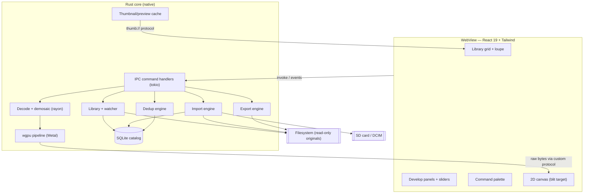
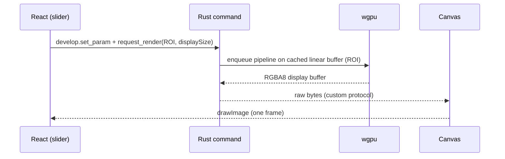
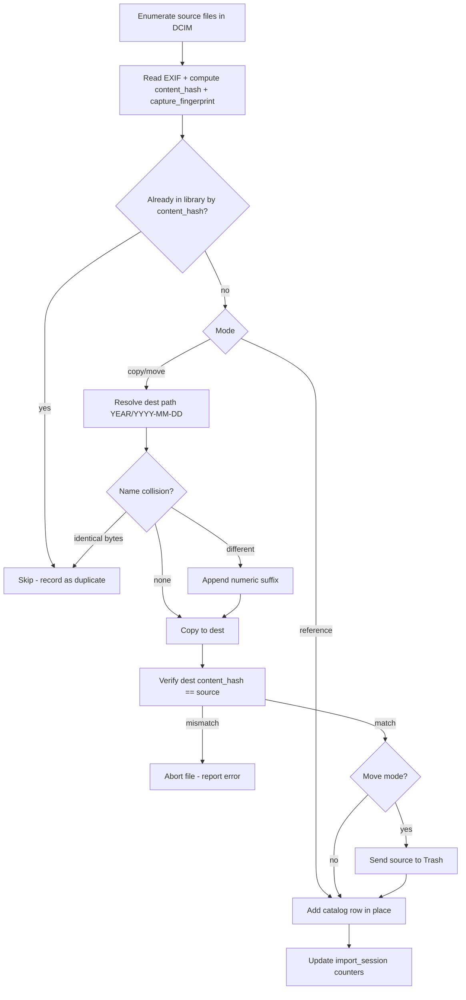
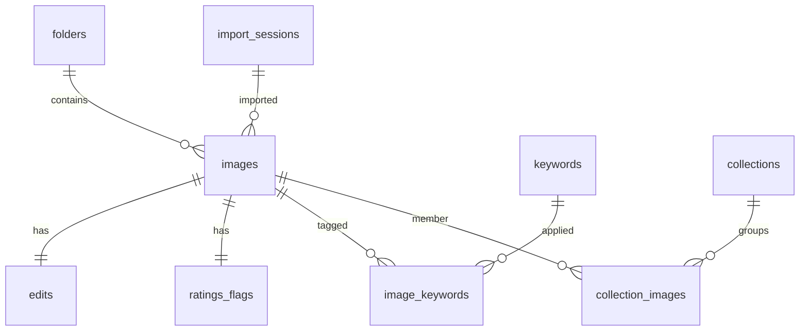

# RAW Editor — Detailed Technical Specification (v1)

> **Status:** Draft for build · **Target:** macOS first · **Audience:** personal tool, solo developer
> **Stack:** Tauri v2 · Rust · React 19 · wgpu (Metal) · SQLite
> **Core stance:** read-only, non-destructive editing · scene-referred linear pipeline · native GPU processing

---

## Table of contents

1. Overview, goals & non-goals
2. Glossary
3. Personas & primary use cases
4. Functional requirements (FR)
5. Non-functional requirements (NFR)
6. System architecture
7. Technology stack & rationale
8. Process, threading & IPC model
9. Library subsystem
10. Import subsystem
11. Deduplication subsystem
12. Develop subsystem (color-managed pixel pipeline)
13. Rendering & display path
14. Culling & organization
15. Export subsystem
16. Data model (full SQLite DDL)
17. UX / UI design
18. Performance engineering
19. Security, safety & data integrity
20. Platform considerations
21. Build, tooling & packaging
22. Testing strategy
23. Roadmap & milestones
24. Open questions / decisions to revisit
25. References
26. Appendices

---

## 1. Overview, goals & non-goals

A local, fast, **non-destructive** RAW photo library manager and develop-parity editor for a single user on macOS. It ingests photos from SD cards, organizes them on disk by capture date, manages a 50k+ image catalog, develops Bayer RAW files through a scene-referred linear pipeline on the GPU, and exports to common formats.

**Primary goals**

- **G1 — Speed.** Instant thumbnails, sub-frame edit feedback, no UI-thread blocking.
- **G2 — Minimal, excellent UX.** Two clean views, opinionated defaults, keyboard + pointer parity.
- **G3 — Non-destructive & read-only editing.** Originals are never rewritten by the develop engine.
- **G4 — Native performance.** Heavy work in Rust; GPU pipeline in wgpu.
- **G5 — Trustworthy file operations.** Import/move/dedup are explicit, verified, reversible (Trash).

**Non-goals (v1)**

- Masking / local adjustments, healing, AI denoise, panorama/HDR merge.
- X-Trans and other non-Bayer CFAs.
- Windows / Linux builds.
- Cloud, sync, sharing, tethering.
- Sidecar / XMP interoperability (catalog-only edit storage).
- Perceptual ("visually similar") deduplication.

---

## 2. Glossary

- **CFA** — Color Filter Array (Bayer mosaic over the sensor).
- **Demosaic** — reconstructing full RGB from the single-channel CFA samples.
- **Scene-referred** — pixel values proportional to scene light (linear), unbounded highlights.
- **Display-referred** — pixel values mapped for a display's range after tone mapping.
- **Working space** — the linear, wide-gamut RGB space edits operate in (**linear ProPhoto** as
  built — "Melissa RGB", what Lightroom edits in; gamut ⊃ Rec.2020. Spec originally said Rec.2020).
- **Pixelpipe** — the ordered chain of processing modules from RAW to output.
- **ROI** — Region Of Interest; the visible/processed sub-region for interactive speed.
- **Content hash** — BLAKE3 digest of the whole file (byte-identity).
- **Capture fingerprint** — hash of normalized capture metadata (same-shot identity).
- **Catalog** — the SQLite database holding all metadata, edits, and organization.

---

## 3. Personas & primary use cases

**Persona:** the developer-photographer — technically sophisticated, shoots Bayer (Sony/Canon/Nikon), values speed and control, manages a large personal archive.

**Use cases**

- **UC1 — Ingest a shoot.** Insert SD card → choose copy/move/reference → files land in date folders, dupes skipped, catalog updated.
- **UC2 — Cull.** Rapid keyboard pass: rate, flag pick/reject, color-label, filter to picks.
- **UC3 — Develop.** Open a RAW, adjust WB/exposure/tone/HSL/detail/lens/crop with instant feedback.
- **UC4 — Find duplicates.** Run dedup, review byte-identical and same-capture groups, Trash extras.
- **UC5 — Export.** Select images → export full-res TIFF and web JPEGs with presets.
- **UC6 — Maintain.** Files moved/renamed outside the app are reconciled, not orphaned.

---

## 4. Functional requirements (FR)

### Library & catalog

- **FR-1** Index directories the user designates as watched roots.
- **FR-2** Watch roots for create/modify/move/delete and reconcile the catalog incrementally.
- **FR-3** Assign each file a stable identity (content hash + path) and reconcile moves/renames automatically.
- **FR-4** Store all metadata, edits, ratings, labels, keywords, and collections in the catalog.
- **FR-5** Display a virtualized thumbnail grid scaling to 50k+ images.
- **FR-6** Provide a loupe/single-image view with zoom and pan.
- **FR-7** Read and index EXIF/maker metadata (camera, lens, capture date, serial, dimensions, ISO, exposure).

### Import

- **FR-8** Detect removable volumes and camera card structure (DCIM).
- **FR-9** Support three import modes: **copy+add**, **move+add (verified)**, **reference (add-in-place)**.
- **FR-10** Organize copied/moved files into `YEAR/YEAR-MONTH-DAY` from EXIF capture date.
- **FR-11** Skip files already present in the library (hash-based) during import.
- **FR-12** Verify destination integrity (hash match) before deleting any source in move mode.
- **FR-13** Record an import session (source, mode, count, timestamp).
- **FR-14** Handle filename collisions (skip if identical, suffix-rename if different).

### Deduplication

- **FR-15** Detect **byte-identical** duplicates via whole-file content hash.
- **FR-16** Detect **metadata-identical** (same-capture) duplicates via capture fingerprint.
- **FR-17** Present duplicate groups for review; user keeps one and Trashes others. Never auto-delete.

### Develop

- **FR-18** Decode Bayer RAW (Sony/Canon/Nikon) and demosaic to linear RGB.
- **FR-19** Provide develop-parity modules: WB, exposure, contrast, tone curve, HSL/color mixer, detail (sharpen + NR), lens corrections, crop/geometry.
- **FR-20** Process in a scene-referred linear working space with a late display transform.
- **FR-21** Apply edits non-destructively as an ordered, versioned parameter set per image.
- **FR-22** Provide interactive ROI rendering with sub-frame latency and a separate full-quality export render.

### Culling & organization

- **FR-23** Star ratings (0–5), pick/reject flags, color labels, keywords/tags.
- **FR-24** Filter and sort by any metadata, rating, flag, label, keyword, or capture attribute.
- **FR-25** Static collections and smart collections (saved queries).

### Export

- **FR-26** Export full-res JPEG/TIFF, web-sized JPEG presets, and custom sizes.
- **FR-27** Per-export options: resize, output color space, JPEG quality, output sharpening, metadata handling.
- **FR-28** Batch export a selection through the full-quality pipeline.

### Application

- **FR-29** Command palette (⌘K) exposing all major actions.
- **FR-30** All destructive file operations require confirmation and route deletions to Trash.

---

## 5. Non-functional requirements (NFR)

- **NFR-1 Performance.** Time-to-first-thumbnail < 50 ms (embedded preview); grid scroll at 60 fps; develop slider latency ≤ 16 ms (one frame) for ROI re-render; full-quality single-image render ≤ ~1 s typical; filtered catalog queries < 50 ms over 50k rows.
- **NFR-2 Scalability.** Correct, responsive behavior at 50k–250k images.
- **NFR-3 Reliability.** No data loss on crash; catalog uses WAL journaling; import/move operations are crash-safe (verify-then-commit).
- **NFR-4 Integrity.** Every copy/move verified by hash; no original mutated by the develop engine.
- **NFR-5 Responsiveness.** UI thread never blocked; all heavy work is async/background with progress.
- **NFR-6 Footprint.** Idle memory modest (Tauri baseline); bounded image-buffer memory via caching/eviction.
- **NFR-7 Portability (latent).** Architecture keeps platform-specific code isolated to ease later Windows/Linux ports.
- **NFR-8 Security.** Webview has no implicit filesystem/network access; capabilities scoped least-privilege.
- **NFR-9 Maintainability.** Modular Rust crates, typed IPC, golden-image pipeline tests.
- **NFR-10 Color accuracy.** Color-managed from camera profile to display/output profile.

---

## 6. System architecture



**Layering**

- **Presentation (WebView/React):** stateless rendering of catalog/edit state; issues commands; receives events; draws rendered buffers to a 2D canvas.
- **Application (Rust commands):** orchestrates subsystems, owns the catalog, enforces safety.
- **Engines (Rust):** library/watcher, import, dedup, decode/demosaic, GPU pipeline, thumbnails, export.
- **Persistence:** SQLite catalog + on-disk thumbnail cache + settings.

---

## 7. Technology stack & rationale

| Concern    | Choice                                            | Rationale                                                                                                                                                                                     |
| ---------- | ------------------------------------------------- | --------------------------------------------------------------------------------------------------------------------------------------------------------------------------------------------- |
| Shell      | **Tauri v2**                                      | Native heavy compute in Rust; least-privilege capabilities enforce read-only; small footprint. Chosen over Electron because the bottleneck (decode/demosaic/pipeline) is native, not webview. |
| GPU        | **wgpu** (Metal now; Vulkan/DX12 later)           | Consistent native GPU compute across OSes; avoids webview-WebGPU fragmentation (WKWebView WebGPU only on recent macOS; WebKitGTK spotty).                                                     |
| Frontend   | **React 19 + Vite + Tailwind**                    | Fast iteration; familiar; webview only does chrome + canvas blit.                                                                                                                             |
| RAW decode | **rawler** primary, **LibRaw** (`rsraw`) fallback | rawler is pure-Rust, actively maintained, covers Bayer + metadata; LibRaw covers 400+ bodies for gaps (gated behind a Cargo feature; C++ toolchain).                                          |
| Hashing    | **BLAKE3**                                        | Cryptographic-strength, very fast; safe to gate deletions on.                                                                                                                                 |
| Catalog    | **SQLite** via `sqlx`/`rusqlite`, WAL             | Handles millions of rows; single-file; Rust-owned, queried over IPC.                                                                                                                          |
| FS watch   | **notify**                                        | Cross-platform; FSEvents on macOS.                                                                                                                                                            |
| Async      | **tokio** (Tauri) + **rayon** (CPU pools)         | Async IO + data-parallel compute.                                                                                                                                                             |

**Electron vs Tauri (summary of the decision):** Tauri wins on the axes that matter here — native heavy-compute home, native GPU via wgpu, lower memory/startup, and enforceable read-only. Electron's only edge (bundled-Chromium rendering consistency) is irrelevant once GPU work lives in native wgpu rather than the webview.

---

## 8. Process, threading & IPC model

### Threads / runtimes

- **UI thread** — webview/JS rendering only.
- **tokio runtime** — async IPC command handlers, file IO orchestration, watcher events.
- **rayon pool** — CPU-bound work: decode, demosaic (preview), hashing, thumbnail generation.
- **GPU submission** — a dedicated context/queue for wgpu; render requests serialized through a channel.
- **Background tasks** — indexer, watcher reconciliation, import jobs, dedup scans; all emit progress events.

### IPC surface (Tauri)

- **Commands (`invoke`)** — request/response, JSON for small payloads:
  - `library.query(filter, sort, page)` → image rows
  - `library.add_root(path)`, `library.rescan(root)`
  - `import.start(source, mode, options)` → session id
  - `dedup.scan(category)` → group ids; `dedup.resolve(group, keep_id)`
  - `develop.get_edit(image_id)`, `develop.set_param(image_id, module, params)`
  - `develop.request_render(image_id, roi, size)` → render token
  - `export.run(selection, preset)` → job id
  - `cull.set_rating/flag/label(image_id, value)`, `tag.add/remove`
- **Events (`emit`)** — progress & async results:
  - `import:progress`, `import:done`
  - `thumb:ready{hash}`, `render:ready{token}`
  - `watch:changed{paths}`, `dedup:progress`
- **Custom protocols** — stream binary without JSON:
  - `thumb://<hash>?size=N` → cached thumbnail bytes
  - `preview://<image_id>` and rendered-buffer delivery via **Tauri raw requests**
- **Capabilities** — `fs:read` scoped to watched roots + import sources; explicit `fs:write` only to the library root and Trash; no network capability.

### Rendering request flow (interactive)



---

## 9. Library subsystem

### Discovery (hybrid: watched folders + catalog)

- User adds **watched roots**. Initial scan enumerates supported files; subsequent changes arrive via `notify`.
- The catalog is the queryable index; the filesystem is the source of truth for pixels.

### File identity & move reconciliation

- Identity = **BLAKE3 content hash** (+ current path).
- On a watcher delete+create or a rescan, reconcile by hash:
  1. If a new path's hash matches a known `images.content_hash` whose old path no longer exists → **treat as move**, update `path`, keep all edits/metadata.
  2. If hash unknown → **new image**, index it.
  3. If a known path disappears with no matching hash elsewhere → mark **missing** (don't delete catalog row; allow relink).
- Hash on index is bounded by a **size pre-read**; full hash computed once and stored.

### On-disk organization (default)

- Copy/move imports route to `‹library_root›/YYYY/YYYY-MM-DD/`.
- **Date source = EXIF `DateTimeOriginal`**; fall back to file mtime only if absent.
- Path template configurable (default `YYYY/YYYY-MM-DD`); reference imports are not reorganized.

```
Library/
├── 2025/
│   ├── 2025-12-31/IMG_0001.ARW
│   └── 2025-12-31/IMG_0002.ARW
└── 2026/
    └── 2026-06-15/DSC_0100.NEF
```

### Thumbnails & previews (50k+ strategy)

- **Tier 0:** embedded JPEG preview extracted from the RAW → shown instantly.
- **Tier 1:** generated grid thumbnail (e.g., 256–512 px) cached on disk, keyed by content hash.
- **Tier 2:** larger loupe preview (e.g., 2048 px) generated on demand.
- Cache stored as files under an app cache dir (or a dedicated `thumbs.db`); LRU eviction by total size budget.
- Grid uses **virtualization**; only visible cells request `thumb://`.

---

## 10. Import subsystem

### Modes

| Mode                                 | Action                            | Source after       | Safety                           |
| ------------------------------------ | --------------------------------- | ------------------ | -------------------------------- |
| **Copy + add** _(default for cards)_ | Copy into library, route by date  | unchanged          | hash-verify destination          |
| **Move + add**                       | Copy + verify, then delete source | removed (verified) | **delete only after hash match** |
| **Reference (add-in-place)**         | Catalog where it sits             | unchanged          | warn if removable volume         |

### Algorithm (per file)



### Details

- DCIM detection on removable volumes (`/Volumes/...`); enumerate RAW + optional camera JPEG siblings.
- Filenames preserved by default; optional rename template (future).
- **Idempotent re-import:** because the dedup gate keys on content hash, reinserting a card never duplicates.
- **Import session** recorded for history and troubleshooting.
- **Optional dual-destination backup** (future): write a second verified copy to a backup root during import — cheap insurance when the card is the only copy.

---

## 11. Deduplication subsystem

Two categories, two hash inputs; both **precomputed at index/import time** so detection is a `GROUP BY` query, not a rescan.

### Category 1 — byte-identical (exact)

- Input: **whole file** → `content_hash` (BLAKE3).
- **Size pre-filter:** only hash within equal `file_size` groups (already stored), avoiding hashing most of the library.
- Detect: `SELECT content_hash FROM images GROUP BY content_hash HAVING COUNT(*) > 1`.

### Category 2 — metadata-identical (same capture)

- Input: **normalized metadata tuple** → `capture_fingerprint` (BLAKE3 of a canonical string):
  `camera_model | body_serial | DateTimeOriginal | SubSecTime | shutter_count | width | height`.
- Catches re-saved RAWs, XMP-appended copies, RAW↔DNG pairs (bytes differ, shot identical).
- Detect: `SELECT capture_fingerprint FROM images GROUP BY capture_fingerprint HAVING COUNT(*) > 1`.

### Review & safety

- Present groups (thumbnails + path + size + date). User selects the keeper; others go to **Trash**.
- **Never auto-delete.** Optional exact byte-compare before deleting (BLAKE3 collision is negligible, so optional).
- Resolution is logged so it can be reviewed.

_(Future tier — perceptual/pixel hash of the decoded preview for "visually identical, different container"; out of v1 scope.)_

---

## 12. Develop subsystem (color-managed pixel pipeline)

### Philosophy

**Scene-referred linear**: most operations run in a linear, wide-gamut working space; tone mapping (the display transform) is applied **late**, so edits are physically meaningful and artifact-light.

### Color management

- **Input profile:** camera-native RGB → working space via a 3×3 color matrix (from rawler/embedded metadata; optional DCP-style profile later).
- **Working space:** **linear ProPhoto** as built (wide-gamut "Melissa RGB"; spec originally said
  Rec.2020), stored as `RGBA32F` on the GPU (preserves >1.0 highlight headroom via `clip_negative`).
- **Display transform:** soft highlight rolloff + ProPhoto→sRGB + sRGB OETF; parametric tone curve
  - HSL applied display-referred. (Output is sRGB today; per-display ICC / P3 is a refinement.)
- **Output/display profile:** convert to **Display P3** (screen) or chosen export profile (sRGB/AdobeRGB); macOS ColorSync handles the monitor. True per-display ICC management is a refinement.

### Pipeline stages (order, space, notes)

| #   | Stage                              | Space                    | Notes                                        |
| --- | ---------------------------------- | ------------------------ | -------------------------------------------- |
| 1   | Black/white level normalize        | sensor linear            | scale raw to [0,1]                           |
| 2   | White balance                      | sensor linear            | per-channel multipliers (camera neutral)     |
| 3   | Highlight handling                 | sensor linear            | clip (v1); reconstruction later              |
| 4   | **Demosaic**                       | camera linear RGB        | Malvar baseline; RCD/AMaZE upgrade           |
| 5   | Noise reduction (capture)          | camera linear            | luminance/chroma NR on linear data           |
| 6   | Input color matrix                 | → working (lin ProPhoto) | camera RGB → working                         |
| 7   | Lens corrections                   | working linear           | distortion (geometry), CA, vignetting (gain) |
| 8   | Crop / geometry                    | working linear           | coordinate transform; enables ROI            |
| 9   | Exposure                           | working linear           | EV multiply                                  |
| 10  | HSL / color mixer                  | working (per-hue)        | hue/sat/lum adjustments                      |
| 11  | Contrast                           | working / via curve      | primarily through tone curve                 |
| 12  | **Tone curve (display transform)** | → display-referred       | linear → display                             |
| 13  | Output color convert               | display profile          | Display P3 / sRGB                            |
| 14  | Output sharpening                  | display-referred         | at output resolution                         |

### Decode & demosaic

- **rawler** decodes Bayer + metadata; **Malvar-He-Cutler** as the quality baseline, **bilinear** for fast preview/thumbnails, **RCD/AMaZE-class** as a later upgrade.
- LibRaw fallback (feature-gated) for unsupported bodies.

### GPU implementation (wgpu)

- Each module is a **compute (or fragment) shader**; the pipeline is a chain over textures with **ping-pong** buffers.
- Working textures: `RGBA16F` (interactive) / `RGBA32F` (export) for headroom.
- **Decoded+demosaiced linear buffer is cached** (GPU or system memory) per active image; slider changes re-run only the cheap downstream modules over the ROI.
- **Tiling** for full-resolution export to bound VRAM.

### Two pipeline qualities

- **Interactive pipe:** ROI at display resolution, fast demosaic, `RGBA16F`, sub-frame latency.
- **Export pipe:** full resolution, high-quality demosaic, `RGBA32F`, tiled, identical math otherwise.

### Edit model

- Per image: an **ordered parameter set** keyed by module, plus a **process version** integer.
- Process version pins the math so future pipeline changes don't silently alter old edits; migrations are explicit.
- Parameters serialized as JSON in `edits.params` (see DDL).

---

## 13. Rendering & display path

- GPU renders to an off-screen target → read back an `RGBA8` (or 10-bit for EDR later) display buffer → stream to the webview via **custom protocol / raw requests** → draw to a 2D `<canvas>`.
- The webview performs **no GPU compute** — only the blit. This sidesteps WKWebView/WebKitGTK WebGPU variance and guarantees consistent results from native wgpu.
- **Why not native-surface overlay:** compositing a wgpu surface directly under the webview is known to flicker (surface contention); the buffer-blit path is robust.
- Display color: output Display P3; macOS ColorSync maps to the monitor. HDR/EDR output is a future enhancement.

---

## 14. Culling & organization

- **Ratings** 0–5, **flags** pick/reject/none, **color labels**, **keywords/tags** (hierarchy-ready).
- **Filtering & sorting** by any field: rating, flag, label, keyword, camera, lens, date, ISO, etc.
- **Static collections** (explicit membership) and **smart collections** (stored query predicates).
- **Keyboard culling loop:** rate/flag advances to the next image; palette for everything else; pointer for precise selection.

---

## 15. Export subsystem

- **Formats:** JPEG, TIFF (8/16-bit). Full-res, web-sized presets, and arbitrary custom sizes.
- **Options:** resize (long edge / exact), output color space (sRGB / Display P3 / AdobeRGB), JPEG quality, output sharpening amount, metadata handling (keep / strip / minimal).
- **Presets:** named, reusable export configurations.
- **Batch:** export a selection; each image runs the **full-quality export pipe** in Rust/wgpu; progress events; output to a chosen folder with a filename template.

---

## 16. Data model (full SQLite DDL)

> WAL journaling; foreign keys on; one catalog file. Frontend never opens the DB directly — all access via Rust commands.

```sql
PRAGMA journal_mode = WAL;
PRAGMA foreign_keys = ON;

CREATE TABLE folders (
  id            INTEGER PRIMARY KEY,
  path          TEXT NOT NULL UNIQUE,
  is_watched    INTEGER NOT NULL DEFAULT 1,
  added_at      INTEGER NOT NULL
);

CREATE TABLE import_sessions (
  id            INTEGER PRIMARY KEY,
  source_volume TEXT,
  mode          TEXT NOT NULL CHECK (mode IN ('copy','move','reference')),
  started_at    INTEGER NOT NULL,
  finished_at   INTEGER,
  file_count    INTEGER NOT NULL DEFAULT 0,
  skipped_count INTEGER NOT NULL DEFAULT 0
);

CREATE TABLE images (
  id                  INTEGER PRIMARY KEY,
  content_hash        BLOB NOT NULL,            -- BLAKE3, whole file
  capture_fingerprint BLOB,                     -- BLAKE3 of metadata tuple
  file_size           INTEGER NOT NULL,
  path                TEXT NOT NULL,
  folder_id           INTEGER REFERENCES folders(id),
  original_filename   TEXT NOT NULL,
  status              TEXT NOT NULL DEFAULT 'present'
                       CHECK (status IN ('present','missing')),
  capture_date        INTEGER,                  -- epoch from EXIF DateTimeOriginal
  camera_make         TEXT,
  camera_model        TEXT,
  body_serial         TEXT,
  lens                TEXT,
  iso                 INTEGER,
  shutter             TEXT,
  aperture            REAL,
  focal_length        REAL,
  width               INTEGER,
  height              INTEGER,
  orientation         INTEGER,
  exif                BLOB,                      -- full metadata blob (JSON/MessagePack)
  imported_at         INTEGER NOT NULL,
  import_session_id   INTEGER REFERENCES import_sessions(id)
);

CREATE TABLE edits (
  image_id        INTEGER PRIMARY KEY REFERENCES images(id) ON DELETE CASCADE,
  process_version INTEGER NOT NULL,
  params          TEXT NOT NULL,                -- JSON: { module: params, ... }
  updated_at      INTEGER NOT NULL
);

CREATE TABLE ratings_flags (
  image_id    INTEGER PRIMARY KEY REFERENCES images(id) ON DELETE CASCADE,
  stars       INTEGER NOT NULL DEFAULT 0 CHECK (stars BETWEEN 0 AND 5),
  flag        TEXT NOT NULL DEFAULT 'none' CHECK (flag IN ('none','pick','reject')),
  color_label TEXT
);

CREATE TABLE keywords (
  id        INTEGER PRIMARY KEY,
  name      TEXT NOT NULL,
  parent_id INTEGER REFERENCES keywords(id)
);

CREATE TABLE image_keywords (
  image_id   INTEGER REFERENCES images(id) ON DELETE CASCADE,
  keyword_id INTEGER REFERENCES keywords(id) ON DELETE CASCADE,
  PRIMARY KEY (image_id, keyword_id)
);

CREATE TABLE collections (
  id         INTEGER PRIMARY KEY,
  name       TEXT NOT NULL,
  is_smart   INTEGER NOT NULL DEFAULT 0,
  query      TEXT                               -- predicate JSON for smart collections
);

CREATE TABLE collection_images (
  collection_id INTEGER REFERENCES collections(id) ON DELETE CASCADE,
  image_id      INTEGER REFERENCES images(id) ON DELETE CASCADE,
  PRIMARY KEY (collection_id, image_id)
);

CREATE TABLE app_meta (
  key   TEXT PRIMARY KEY,
  value TEXT
);

-- Indexes for 50k+ scale
CREATE INDEX idx_images_content_hash        ON images(content_hash);
CREATE INDEX idx_images_capture_fingerprint ON images(capture_fingerprint);
CREATE INDEX idx_images_file_size           ON images(file_size);
CREATE INDEX idx_images_folder              ON images(folder_id);
CREATE INDEX idx_images_capture_date        ON images(capture_date);
CREATE INDEX idx_images_camera              ON images(camera_model);
CREATE INDEX idx_rf_stars                   ON ratings_flags(stars);
CREATE INDEX idx_rf_flag                    ON ratings_flags(flag);
CREATE INDEX idx_rf_label                   ON ratings_flags(color_label);
```

### Entity relationships



### Migrations & durability

- `app_meta.schema_version` tracks schema; migrations run on launch, with a pre-migration catalog copy.
- **Edit storage is catalog-only (by choice).** The catalog is a single file — recommend scheduled backups (Time Machine / copy). A `Export edits → JSON` command can be added if portability is later wanted.

---

## 17. UX / UI design

### Views

- **Library:** virtualized grid + loupe; filter bar; left = folders/collections; right = metadata/keywords; bottom = filmstrip.
- **Develop:** large canvas; right = module panels (WB, exposure, tone curve, HSL, detail, lens, crop); filmstrip for navigation; histogram.

### Interaction

- **Balanced:** ⌘K command palette for all actions; full keyboard shortcuts for culling/navigation; precise pointer/trackpad for sliders, curve, crop, pan/zoom.
- **States:** explicit empty (no roots), loading (thumbnail shimmer), error (decode failure badge), missing-file (relink prompt).
- **Theming:** dark default, light option; respects system appearance.

### Principles

- Minimal chrome, opinionated defaults, instant feedback, no modal blocking for long tasks (progress in a status area).

---

## 18. Performance engineering

### Budgets

| Action                         | Target                                       |
| ------------------------------ | -------------------------------------------- |
| First thumbnail (embedded)     | < 50 ms                                      |
| Grid scroll                    | 60 fps (virtualized)                         |
| Develop slider → ROI re-render | ≤ 16 ms                                      |
| Full-quality single render     | ≤ ~1 s                                       |
| Filtered catalog query (50k)   | < 50 ms                                      |
| Import                         | IO-bound; hashing parallel + size pre-filter |

### Tactics

- **Caching layers:** embedded preview → thumb cache → decoded linear buffer cache → ROI render cache.
- **Decode once per image;** keep the linear buffer hot while editing; re-run only downstream modules on parameter change.
- **rayon** for parallel decode/hash/thumbnail; **size pre-filter** bounds hashing cost.
- **GPU**: persistent textures, ping-pong, ROI-only interactive passes, tiled export.
- **Memory budget:** cap resident decoded buffers; LRU eviction; stream/tiled export to avoid full-frame `RGBA32F` blowups.

---

## 19. Security, safety & data integrity

- **Read-only editing guarantee:** the develop engine never writes originals; edits live in the catalog.
- **Capability scoping:** webview gets `fs:read` on watched roots + import sources; `fs:write` only to library root + Trash; no network capability.
- **Destructive-op safety:** copy/move/dedup are explicit and confirmable; **all deletions go to Trash**, never hard unlink; move deletes source **only after hash verification**.
- **Crash safety:** verify-then-commit ordering; WAL catalog; partial imports resumable/reportable.
- **Integrity:** BLAKE3 verification on every copy/move; mismatches abort that file and report.

---

## 20. Platform considerations

- **macOS (v1):** wgpu→Metal; WKWebView; FSEvents; removable volumes under `/Volumes`; ColorSync; code signing + notarization.
- **Latent portability:** isolate platform specifics (paths, volume detection, Trash, color/display) behind traits so Windows (WebView2, DX12, Recycle Bin) and Linux (WebKitGTK, Vulkan) ports are incremental. WebKitGTK is the riskiest future webview; native wgpu mitigates the GPU half.

---

## 21. Build, tooling & packaging

- **Workspace:** Cargo workspace — crates: `core-db`, `core-library`, `core-import`, `core-dedup`, `core-decode`, `core-pipeline` (wgpu), `core-export`, `app` (Tauri). Frontend in `/ui` (Vite).
- **Feature flags:** `libraw-fallback` (C++ toolchain) off by default; enable per build as needed.
- **Release builds:** `--release` with LTO; shader precompilation where possible.
- **Packaging:** Tauri bundler → signed, notarized `.dmg`; Tauri updater for releases.
- **CI:** build + unit/integration tests + golden-image pipeline tests; validate LibRaw build path; lint (clippy) + format.

---

## 22. Testing strategy

- **Unit:** hashing, fingerprint canonicalization, path/date routing, collision logic, move-mode verify-before-delete.
- **Integration:** import idempotency (re-import same card → no dupes), watcher move reconciliation, dedup grouping correctness on synthetic sets.
- **Golden-image pipeline tests:** fixed RAW inputs → expected output compared by PSNR/hash within tolerance; guards against accidental pipeline math changes (paired with `process_version`).
- **Decode coverage:** sample RAWs per supported body (Sony/Canon/Nikon); LibRaw fallback path.
- **Performance regression:** measure render latency and query times against budgets.
- **Safety tests:** simulated copy corruption → move must abort, source preserved.

---

## 23. Roadmap & milestones

| Milestone                 | Deliverable                                                                                                                     | Acceptance                                                   |
| ------------------------- | ------------------------------------------------------------------------------------------------------------------------------- | ------------------------------------------------------------ |
| **M1 — One image E2E**    | Decode Bayer → demosaic → minimal linear pipe → wgpu render → canvas blit                                                       | A RAW renders correctly with WB+exposure on canvas, on macOS |
| **M2 — Library + import** | Watched roots, content-hash identity, catalog, virtualized grid, embedded thumbs, SD import (copy/move/reference), date routing | Import a card; grid shows dated, deduped images              |
| **M3 — Dedup**            | Size pre-filter + content hash + capture fingerprint; group queries; Trash review UI                                            | Byte- and metadata-identical groups found; safe resolve      |
| **M4 — Develop**          | Full module set, scene-referred pipeline, interactive ROI, edit persistence, two pipe qualities                                 | All modules adjust with ≤16 ms feedback; edits persist       |
| **M5 — Cull & organize**  | Ratings, flags, labels, keywords, filtering, smart collections, keyboard loop                                                   | Rapid keyboard cull + filter to picks                        |
| **M6 — Export**           | Full-quality export pipe, presets, custom sizes, batch                                                                          | Batch export TIFF + web JPEG with correct color              |
| **M7 — Polish**           | Command palette, perf passes, packaging (sign/notarize/update)                                                                  | Signed DMG; budgets met                                      |

---

## 24. Open questions / decisions to revisit

1. **Catalog-only durability** — single point of failure at 50k edits; revisit JSON-export safety net if it bites.
2. **Native wgpu → canvas blit performance** in WKWebView — validate readback/transfer latency in M1.
3. **Demosaic quality vs speed** — Malvar baseline now; decide if RCD/AMaZE is worth porting for v1.
4. **Dual-destination import backup** — add for move mode (card-only-copy scenario)?
5. **Highlight reconstruction** — clip in v1; add reconstruction later.
6. **Display ICC management** — Display P3 + ColorSync now; full per-display ICC later.
7. **Project name / repo name** — TBD.

---

## 25. References

- Tauri 2.0 (raw requests, IPC): https://v2.tauri.app/blog/tauri-20/
- Tauri webview engines: https://v2.tauri.app/reference/webview-versions/
- Tauri wgpu surface flicker issue: https://github.com/tauri-apps/tauri/issues/9220
- darktable architecture (pixelpipe, history, sidecars): https://deepwiki.com/darktable-org/darktable
- darktable read-only / sidecars: https://docs.darktable.org/usermanual/development/en/overview/sidecar-files/sidecar/
- darktable pixelpipe & module order: https://docs.darktable.org/usermanual/development/en/darkroom/pixelpipe/the-pixelpipe-and-module-order/
- rawler (Rust RAW decode): https://lib.rs/crates/rawler
- rawloader: https://github.com/pedrocr/rawloader
- LibRaw bindings (rsraw): https://github.com/hexilee/rsraw — LibRaw: https://www.libraw.org
- zenraw (scene-referred linear, swappable backends): https://github.com/imazen/zenraw
- WebGPU browser status: https://www.webgpu.com/news/webgpu-hits-critical-mass-all-major-browsers/
- WebKit WebGPU (Safari 26.x): https://webkit.org/blog/17640/webkit-features-for-safari-26-2/
- Tauri vs Electron benchmarks: https://www.pkgpulse.com/guides/electron-vs-tauri-2026

---

## 26. Appendices

### A. Capture fingerprint canonicalization

Concatenate normalized fields with a separator, lowercase, trim:
`camera_model | body_serial | DateTimeOriginal(ISO-8601) | SubSecTime | shutter_count | width | height`
→ BLAKE3 → `capture_fingerprint`. Missing fields are recorded empty (a fingerprint with too many empty fields is flagged low-confidence and excluded from auto-grouping).

### B. Edit params JSON (illustrative shape)

```json
{
  "process_version": 1,
  "white_balance": { "temp": 5200, "tint": 8 },
  "exposure": { "ev": 0.35 },
  "contrast": { "amount": 0.12 },
  "tone_curve": {
    "points": [
      [0, 0],
      [0.25, 0.22],
      [0.75, 0.8],
      [1, 1]
    ]
  },
  "hsl": { "red": { "h": 0, "s": -10, "l": 0 } },
  "detail": { "sharpen": 35, "nr_luma": 12, "nr_chroma": 20 },
  "lens": { "distortion": true, "ca": true, "vignette": 0 },
  "crop": { "x": 0.0, "y": 0.0, "w": 1.0, "h": 1.0, "angle": 0.0 }
}
```

### C. Supported inputs (v1)

- Bayer RAW from Sony (.ARW), Canon (.CR2/.CR3), Nikon (.NEF), plus DNG (Bayer).
- Out: X-Trans, monochrome sensors, video.
